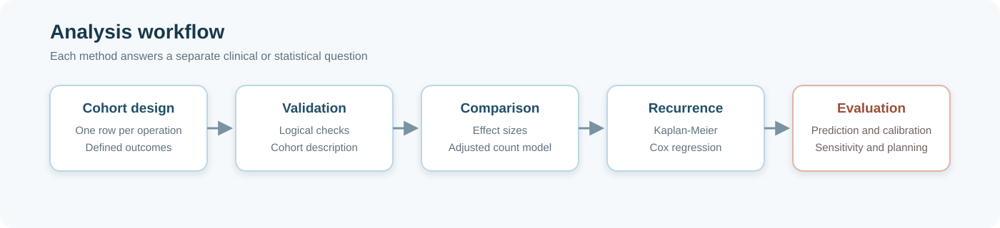
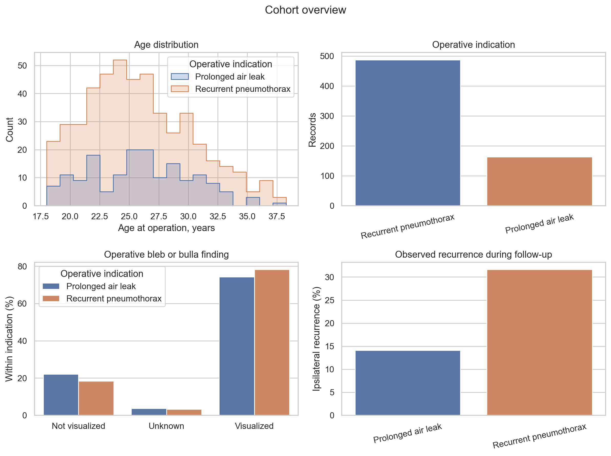
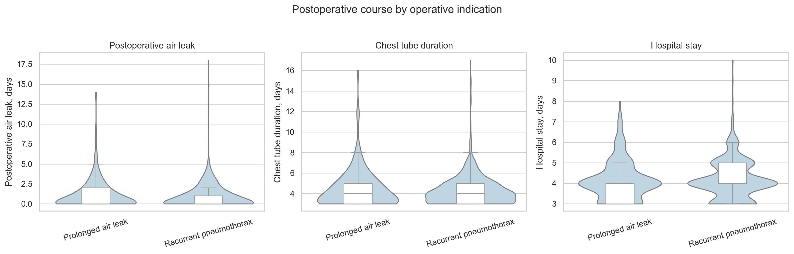
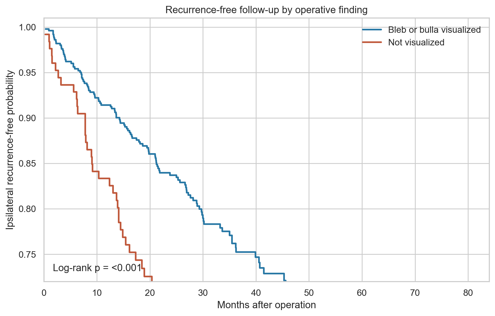
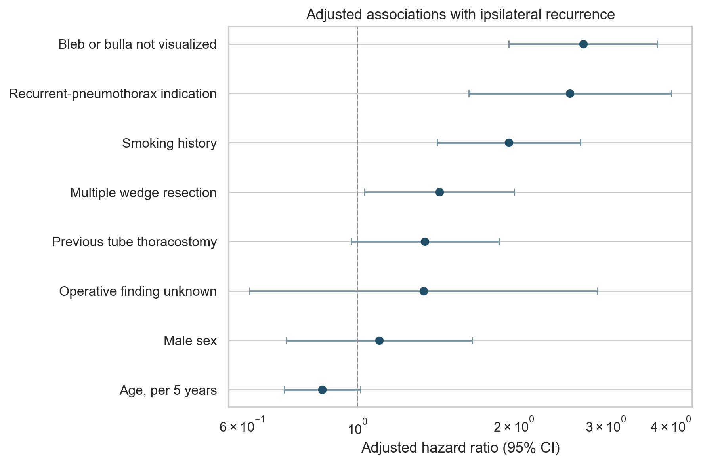
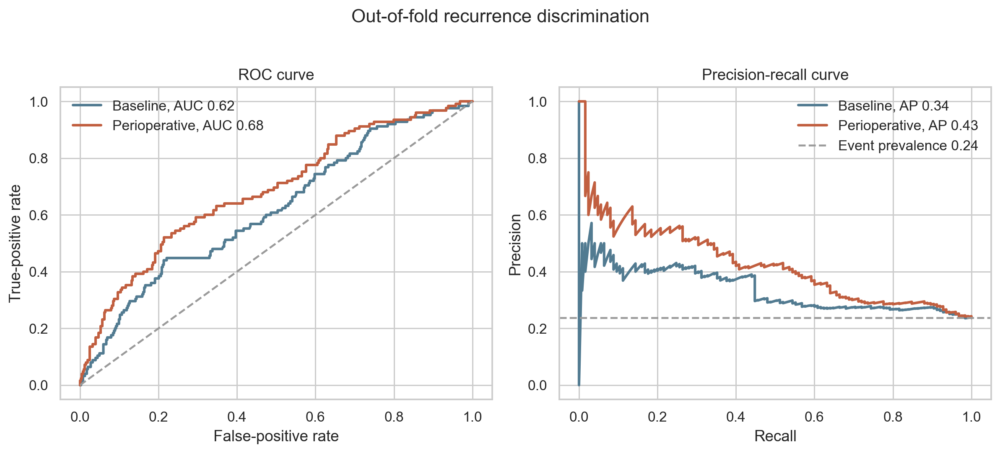
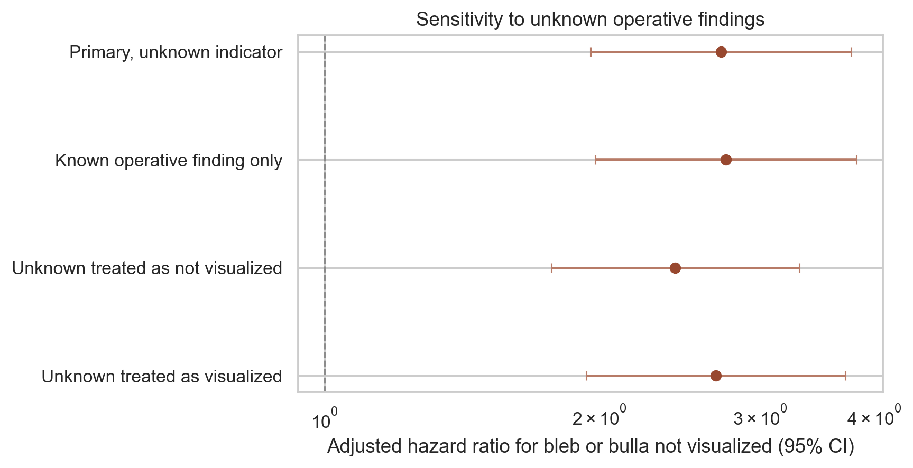

# Clinical Outcomes After VATS for Primary Spontaneous Pneumothorax

A reproducible clinical data science project examining operative indication, postoperative course, and ipsilateral recurrence after VATS wedge resection with pleural abrasion.

> This repository uses a fully generated cohort of 650 records. No patient-level source data were copied, transformed, or published. The numerical findings have no medical meaning.



## Project highlights

- Reproducible cohort generation with a fixed random seed
- Data dictionary, missingness review, and logical validation checks
- Effect sizes, confidence intervals, and false-discovery-rate correction
- Kaplan-Meier estimation and multivariable Cox regression
- Proportional-hazards assumption checks using Schoenfeld residuals
- Five-fold out-of-fold prediction for 24-month recurrence
- ROC, precision-recall, Brier score, and calibration assessment
- Paired bootstrap comparison of model AUCs
- Robust count regression for hospital stay
- Missing-data sensitivity analysis and prospective event planning

## Main notebook

[Open the executed analysis notebook](notebooks/clinical_outcomes_after_vats.ipynb)

The notebook generates the complete cohort and runs the analysis from beginning to end. It also recreates every CSV table and PNG figure in the repository.

## Clinical questions

1. How do operations for recurrent pneumothorax and prolonged air leak differ?
2. Which perioperative characteristics are associated with ipsilateral recurrence?
3. Does the operative bleb or bulla finding remain informative after adjustment?
4. Does perioperative information improve 24-month recurrence prediction?
5. How sensitive is the main recurrence estimate to an unknown operative finding?

Association and prediction are treated as separate analytical tasks. The project does not interpret observational estimates as treatment effects.

## Analysis overview

| Stage | Purpose | Main output |
|---|---|---|
| Cohort design | Define one row per operation and document each variable | Data dictionary |
| Validation | Check identifiers, eligibility ranges, durations, and event logic | Validation and missingness tables |
| Cohort description | Summarize clinical characteristics by operative indication | Median, IQR, count, and percentage table |
| Group comparison | Compare postoperative and categorical characteristics | Mann-Whitney, chi-square, Fisher, and effect-size results |
| Recurrence analysis | Use event and follow-up time together | Kaplan-Meier curves and log-rank test |
| Adjusted association | Estimate recurrence associations after covariate adjustment | Cox proportional-hazards model |
| Model checking | Examine time trends in model residuals | Proportional-hazards diagnostics |
| Prediction | Estimate 24-month recurrence out of sample | Five-fold out-of-fold probabilities |
| Performance assessment | Evaluate ranking and probability accuracy | ROC, precision-recall, Brier, and calibration results |
| Hospital stay | Model expected postoperative length of stay | Robust Poisson regression |
| Sensitivity | Test alternative handling of unknown operative findings | Four adjusted Cox estimates |
| Planning | Translate effect assumptions into future study requirements | Event and sample-size scenarios |

## Result snapshot

| Result | Estimate |
|---|---:|
| Ipsilateral recurrences during follow-up | 177 of 650 |
| Recurrence after recurrent-pneumothorax indication | 31.6% |
| Recurrence after prolonged-air-leak indication | 14.1% |
| Adjusted HR for recurrent-pneumothorax indication | 2.56 [95% CI 1.64 to 4.01] |
| Adjusted HR when no bleb or bulla was visualized | 2.72 [95% CI 1.96 to 3.77] |
| Adjusted HR for smoking history | 1.95 [95% CI 1.42 to 2.69] |
| Baseline model out-of-fold ROC AUC | 0.62 [95% CI 0.56 to 0.67] |
| Perioperative model out-of-fold ROC AUC | 0.68 [95% CI 0.63 to 0.74] |
| Paired AUC difference | 0.07 [95% bootstrap CI 0.03 to 0.11] |

The recurrence estimates demonstrate the statistical workflow. They are not biological findings or evidence for clinical use.

## Selected outputs

### Cohort characteristics



The indication groups have similar age, sex, operated side, and operative finding distributions. Previous tube thoracostomy is more common in the recurrent-pneumothorax group.

### Postoperative course



Postoperative air leak, chest tube duration, and hospital stay show substantial overlap between indication groups. Effect sizes are close to zero after false-discovery-rate correction.

### Recurrence-free follow-up



The Kaplan-Meier analysis uses recurrence and censoring times together. The curves compare records with and without a visualized bleb or bulla.

### Adjusted recurrence associations



The Cox model adjusts for operative indication, bleb status, age, sex, smoking history, previous tube thoracostomy, and wedge count. No strong proportional-hazards violation was detected after multiple-testing correction.

### Out-of-fold prediction



The perioperative model improves ROC AUC and average precision compared with the baseline model. Its discrimination remains moderate and requires external validation before any clinical application.

### Sensitivity to unknown operative findings



The main bleb or bulla estimate remains similar under four approaches to the unknown category. Adjusted hazard ratios range from 2.42 to 2.75.

## Statistical methods

### Descriptive analysis

Continuous variables are reported with medians and interquartile ranges. Categorical variables are reported with counts and percentages. Wilson intervals describe uncertainty around recurrence percentages.

### Group comparisons

Mann-Whitney U tests are paired with rank-biserial correlations and bootstrap intervals for median differences. Categorical comparisons use chi-square or Fisher exact tests with odds ratios and Cramer's V. Benjamini-Hochberg correction is applied within exploratory test families.

### Time-to-event analysis

Kaplan-Meier estimates describe recurrence-free follow-up. The log-rank test compares unadjusted curves. Cox regression estimates adjusted hazard ratios and retains records with unknown operative findings through a separate indicator.

### Prediction

Logistic models estimate recurrence within 24 months. Records censored before 24 months without recurrence are excluded because their outcome is unknown. Imputation, scaling, and encoding remain inside five-fold cross-validation.

### Sensitivity and planning

The main Cox estimate is repeated under four missing-data conventions. Schoenfeld's approximation estimates the recurrence events and total records needed under several prospective effect assumptions.

## Repository structure

```text
.
├── README.md
├── requirements.txt
├── assets/
│   └── analysis-workflow.svg
├── notebooks/
│   └── clinical_outcomes_after_vats.ipynb
├── data/
│   ├── synthetic_psp_vats_cohort.csv
│   └── data_dictionary.csv
├── figures/
│   └── 01 through 08 analysis figures
└── tables/
    └── validation, descriptive, model, and planning outputs
```

## Run locally

```bash
git clone https://github.com/elifbayindir/psp-vats-clinical-outcomes.git
cd psp-vats-clinical-outcomes
python -m venv .venv
source .venv/bin/activate
python -m pip install -r requirements.txt
jupyter lab
```

Open `notebooks/clinical_outcomes_after_vats.ipynb` and run all cells. The fixed seed reproduces the same cohort, tables, and figures.

## Scope and limitations

This project demonstrates statistical reasoning, reproducible analysis, and careful communication of observational results. It does not provide causal estimates, external validation, treatment recommendations, or a clinical decision tool.
